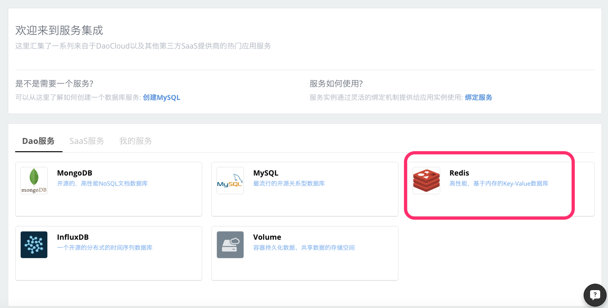
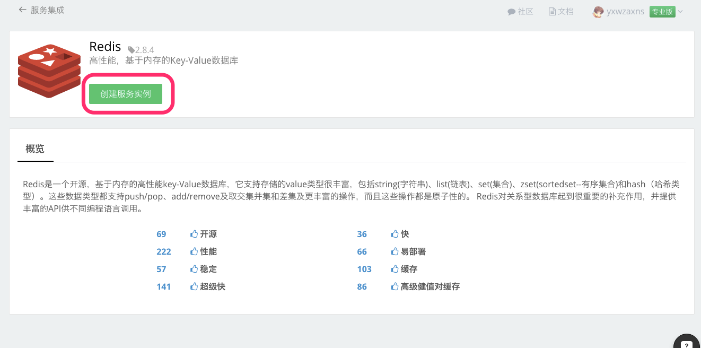
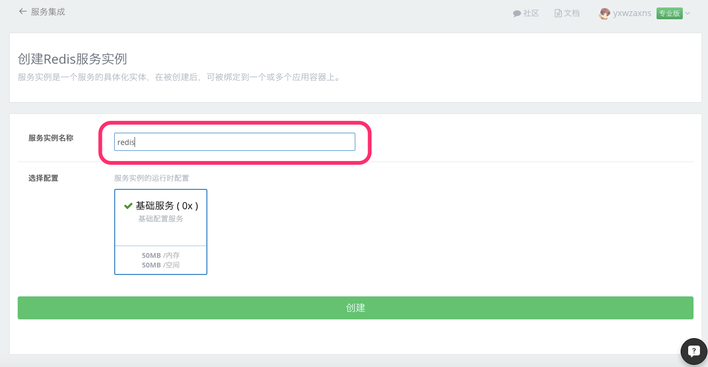
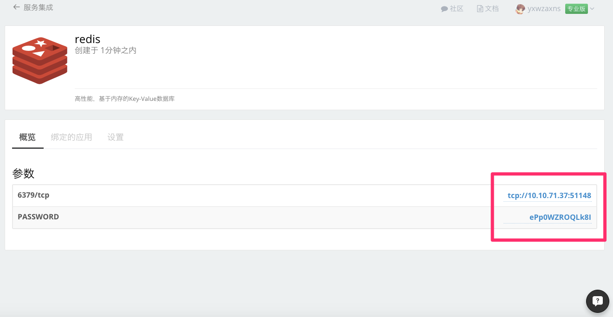
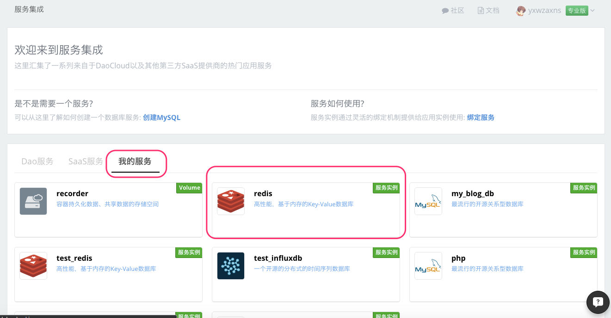
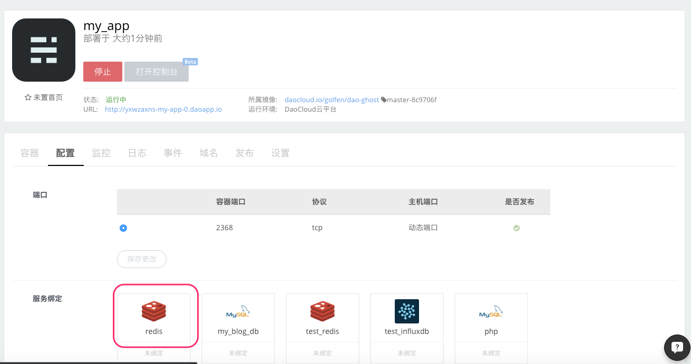

#### 什么是 Redis

Redis 是一个开源，基于内存的高性能 key-Value 数据库，它支持存储的 value 类型很丰富，包括 string (字符串)、list (链表)、set (集合)、zset (sortedset--有序集合)和 hash（哈希类型）。这些数据类型都支持 push/pop、add/remove 及取交集并集和差集及更丰富的操作，而且这些操作都是原子性的。Redis 对关系型数据库起到很重要的补充作用，并提供丰富的 API 供不同编程语言调用。

#### 在 DaoCloud 服务集成创建 Redis 服务

1.登录 DaoCloud 控制台，选择「服务集成」。


2.在「Dao服务」里选择 Redis 服务。



3.点击 「创建服务实例」。



4.输入服务实例名称，点击「创建」按钮



5.创建完成，可以看到 Redis 服务的相关参数。



6.查看我已创建的服务



#### Redis 与应用绑定

1.选择需要绑定 Redis 服务的应用，在「应用配置」下的「服务绑定」里选择刚刚创建好的 Redis 服务。



2.当您选择了要绑定的 Redis 服务以后，会发现下面出现了关于连接 Redis 所需要的信息，在您选择保存更改以后，这些信息会写入到您绑定应用的环境变量里，这样您就可以在代码里通过读取相关环境变量来使用 Redis 服务。(您可以在创建应用时绑定 Redis 服务，也可以把 Redis 服务绑定在现有的应用上)。

>>> 在一些情况下，请根据代码内读取环境变量的约定，或开源项目 README 文件中的指导，修改环境变量的服务别名。


3.如何读取环境变量，下面我们展示一段使用 Ruby 语言来读写 Redis 的具体代码（完整的 Docker 镜像请前往 [GitHub](https://github.com/DaoCloud/DaoCloud_redis) ，您可以 fork 到自己的项目里运行这个例子）

```ruby
#myapp.rb
require 'sinatra'
require 'redis'

module Sinatra
  class Base
    set :server, %w[thin mongrel webrick]
    set :bind, '0.0.0.0'
    set :port, 8080
  end
end

redis = Redis.new(	:host => ENV['REDIS_PORT_6379_TCP_ADDR'],
        			:port => ENV['REDIS_PORT_6379_TCP_PORT'],
        			:password => ENV['REDIS_PASSWORD'])

get '/' do
  host=		ENV['REDIS_PORT_6379_TCP_ADDR']
  port=		ENV['REDIS_PORT_6379_TCP_PORT']
  password=	ENV['REDIS_PASSWORD']
  "Redis_info:\nhost is#{host}\nport is:#{port}\npassword is:#{password}"
end

get '/set/*/*' do
  redis.set(params['splat'][0],params['splat'][1])
end

get '/get/:name' do
  redis.get(params['name'])
end
```

成功部署后访问应用，便可以看到连接 Redis 所需要的相关信息已经被成功读取出来

#### 管理 Redis 服务

1.管理我的 Redis 服务

在 GitHub 上有许多 Redis 服务管理工具，比如 [phpRedisAdmin](https://github.com/erikdubbelboer/phpRedisAdmin.git)，这里我们把 phpRedisAdmin 构建成 Docker 镜像来管理我们的 Redis 服务。

GitHub 地址：[https://github.com/DaoCloud/DaoCloud_phpRedisAdmin](https://github.com/DaoCloud/DaoCloud_phpRedisAdmin)

2.部署管理工具，绑定之前创建的 Redis 服务，应用启动成功后就可以执行常规的 Redis 服务管理操作


至此，我们已经掌握了如何创建和使用 DaoCloud 平台之上的 Redis 服务。